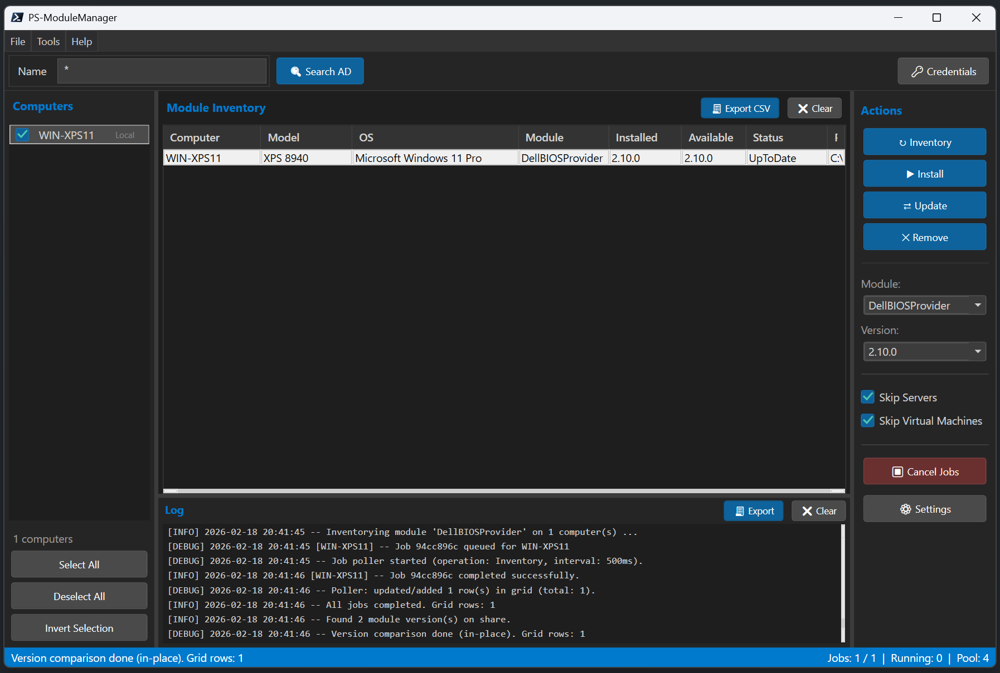

# PS-ModuleManager

A **single-file PowerShell module** (~3585 lines) with a WPF GUI for managing PowerShell modules across local and remote domain-joined computers.

> **Requires Windows PowerShell 5.1** -- all code is PS 5.1-compatible. No PowerShell 7+ syntax.



## Features

- **AD Computer Discovery** -- ADSI-based enumeration with OU filtering, wildcard search, and enabled-only toggle (no RSAT required)
- **Parallel Remote Operations** -- Runspace pool with configurable concurrency for fast multi-target operations
- **Module Inventory** -- Query installed modules on remote computers; compare versions against a central share
- **Install / Update / Remove** -- Deploy modules from a central network share (ZIP or folder-based)
- **Version Status** -- Color-coded grid: green (up-to-date), orange (outdated), red (missing), gray (unreachable)
- **In-place Observable Updates** -- `INotifyPropertyChanged` grid items update in-place; no clear/rebuild on refresh
- **Settings UI** -- Built-in settings dialog with connectivity tests, import/export; persists to `settings.json`
- **Settings Sync** -- Skip Servers / Skip VMs checkboxes sync bidirectionally with the Settings dialog and persist automatically
- **Structured Logging** -- Timestamped log output to the UI pane and log files with automatic rotation (30-day / 10 MB cap)
- **Dark-themed WPF GUI** -- VS Code-inspired interface with custom styles for buttons, checkboxes, comboboxes, scrollbars, and data grid; all XAML defined inline
- **Credential Dialog** -- Pure WPF dark-themed credential dialog; avoids WinForms/dispatcher conflicts
- **Keyboard Shortcuts** -- `Ctrl+R` (Inventory), `Ctrl+S` (Settings), `Ctrl+E` (Export CSV), `Escape` (Cancel jobs)
- **CSV Export** -- Export module inventory grid to CSV via `SaveFileDialog`
- **Module Dependencies** -- Reads `.psd1` `RequiredModules` before install and logs warnings
- **LDAP Injection Protection** -- `ConvertTo-PSMMLdapSafeString` sanitizes all user-provided search filters

## Architecture

PS-ModuleManager uses a **SyncHash + Dispatcher** pattern:

- `$script:SyncHash = [hashtable]::Synchronized(@{})` -- central state store shared across all runspaces
- All named WPF controls are stored as `$syncHash.<ControlName>` at startup
- Background operations update the UI thread-safely via `$syncHash.Window.Dispatcher.Invoke([Action]{...})`
- `ObservableCollection[T]` bindings with `INotifyPropertyChanged` C# classes drive automatic grid and list updates

## Requirements

- Windows PowerShell 5.1
- .NET Framework 4.5+ (for WPF)
- WinRM enabled on target computers (for remote operations)
- Domain-joined machine (for ADSI computer discovery)

## Quick Start

```powershell
# Import the module
Import-Module .\PS-ModuleManager.psd1

# Launch the GUI
Show-ModuleManagerGUI

# Or with a custom settings file
Show-ModuleManagerGUI -SettingsPath "C:\Config\settings.json"

# Launch maximized and centered on owner window
Show-ModuleManagerGUI -WindowStartupLocation CenterOwner -WindowState Maximized
```

Alternatively, use the self-elevating launcher script:

```powershell
# Automatically elevates to Administrator and hides the console window
.\PS-ModuleManager.ps1
```

Or create a desktop shortcut:

```powershell
.\scripts\Create-Shortcut.ps1
```

## Configuration

Edit `settings.json` (created automatically on first run) or use the built-in Settings dialog (`Ctrl+S`):

| Setting | Description | Default |
|---------|-------------|---------|
| `DomainLdapPath` | LDAP path to domain root | *(auto-detect)* |
| `OuFilter` | OU scope for computer search | *(all)* |
| `CentralSharePath` | UNC path to module repository | *(empty)* |
| `ModuleSearchPaths` | Local paths to search for installed modules | `C:\Program Files\WindowsPowerShell\Modules` |
| `MaxConcurrency` | Parallel runspace threads | `4` |
| `CredentialMode` | `Default` / `Prompt` / `Stored` | `Default` |
| `LogPath` | Directory for log files | `logs/` |
| `LogLevel` | `DEBUG` / `INFO` / `WARN` / `ERROR` | `INFO` |
| `RetryCount` | Retry attempts for failed operations | `2` |
| `ReachabilityCheck` | Test WinRM before operations | `true` |
| `JobTimeoutSeconds` | Per-job timeout for remote operations | `300` |
| `ExcludeServers` | Skip server OS computers during discovery | `false` |
| `ExcludeVirtual` | Skip virtual machines during discovery | `false` |
| `GlobalExcludeList` | Array of computer names to always exclude | `[]` |
| `OSFilter` | Additional OS substring filter for computer discovery | *(empty)* |

## Central Share Layout

```
\\server\PSModules\
+-- ModuleA\
|   +-- 1.0.0\
|   |   +-- ModuleA.psm1 (or module.zip)
|   +-- 1.1.0\
|       +-- ModuleA.psm1
+-- ModuleB\
    +-- 2.0.0\
        +-- module.zip
```

Each version folder can contain **either** loose module files (`.psm1`, `.psd1`, etc.) **or** a `module.zip`. ZIP files can contain module files at the archive root or inside a single wrapper folder -- the installer automatically detects and unwraps it. Source files are staged onto the remote computer before extraction, so no CredSSP or double-hop configuration is needed.

## Project Structure

```
PS-ModuleManager/
+-- PS-ModuleManager.psd1          # Module manifest
+-- PS-ModuleManager.psm1          # Single comprehensive module (~3585 lines, all code + inline WPF XAML)
+-- PS-ModuleManager.ps1           # Self-elevating launcher (hides console, imports module, launches GUI)
+-- settings.json                  # Configuration file (auto-created on first run)
+-- CHANGELOG.md
+-- README.md
+-- LICENSE
+-- .github/
|   +-- copilot-instructions.md    # GitHub Copilot custom instructions and coding standards
+-- dev/
|   +-- PLAN.md                    # Detailed project plan and architecture
+-- scripts/
|   +-- Create-Shortcut.ps1        # Creates a desktop shortcut to launch the module
|   +-- Get-ADSIInfo.ps1           # Standalone script to discover domain LDAP path and OUs
+-- logs/                          # Log file output directory
+-- test/
|   +-- PS-ModuleManager.Tests.ps1 # Pester v5 unit tests (non-WPF business logic)
```

## Exported Commands

| Command | Description |
|---------|-------------|
| `Show-ModuleManagerGUI` | Opens the WPF Module Manager window. Accepts `-SettingsPath`, `-WindowStartupLocation`, and `-WindowState` parameters. |
| `Get-ADSIInfo` | Discovers the domain LDAP path and enumerates available OUs via ADSI. Useful for populating `settings.json`. |

## Internal Functions

| Function | Region | Purpose |
|----------|--------|---------|
| `Get-PSMMDefaultSettings` | Configuration | Returns hashtable with all default settings |
| `Import-PSMMSettings` | Configuration | Loads `settings.json`, merges with defaults |
| `Export-PSMMSettings` | Configuration | Persists settings hashtable to JSON file |
| `Test-PSMMSettings` | Configuration | Validates settings; returns list of issues |
| `Write-PSMMLog` | Logging | Structured log to file and UI pane (dispatcher-safe) |
| `Invoke-PSMMLogRotation` | Logging | Removes log files older than 30 days; enforces 10 MB cap |
| `ConvertTo-PSMMLdapSafeString` | ADSI Service | Escapes special LDAP characters in user-provided filters |
| `Get-PSMMComputers` | ADSI Service | Queries AD for computer objects via `DirectorySearcher` |
| `New-PSMMRunspacePool` | Runspace Pool | Creates and opens a bounded runspace pool |
| `Invoke-PSMMParallel` | Runspace Pool | Queues script blocks across computers in the pool |
| `Receive-PSMMJobs` | Runspace Pool | Polls and harvests completed job results |
| `Stop-PSMMAllJobs` | Runspace Pool | Cancels all running jobs |
| `Close-PSMMRunspacePool` | Runspace Pool | Closes and disposes the pool |
| `Get-PSMMRemoteModules` | Module Inventory | Runs `Get-Module -ListAvailable` on remote computers |
| `Get-PSMMShareModules` | Module Inventory | Lists modules and versions on the central share |
| `Compare-PSMMModuleVersions` | Module Inventory | Compares installed vs. share versions |
| `Get-PSMMModuleDependencies` | Module Deployment | Reads `.psd1` `RequiredModules` before install |
| `Install-PSMMModule` | Module Deployment | Installs module from share to remote computers |
| `Uninstall-PSMMModule` | Module Deployment | Removes module from remote computers |
| `Show-PSMMCredentialDialog` | Credential Mgmt | Pure WPF dark-themed credential input dialog |
| `Get-PSMMCredential` | Credential Mgmt | Obtains credentials per configured `CredentialMode` |
| `Initialize-PSMMSyncHash` | SyncHash Helpers | Populates `$script:SyncHash` with all named WPF controls |
| `Invoke-PSMMDispatcherUpdate` | SyncHash Helpers | Thread-safe UI update via `Dispatcher.Invoke()` |
| `Invoke-PSMMBackgroundRunspace` | SyncHash Helpers | Spawns runspace with automatic `$syncHash` injection |
| `New-PSMMWindow` | WPF Helpers | Parses XAML string into WPF `Window` object |
| `Find-PSMMControl` | WPF Helpers | Finds named control inside a WPF window |
| `Invoke-PSMMSafeAction` | WPF Helpers | Wraps event handlers with error recovery and `MessageBox` |
| `Register-PSMMMainWindowEvents` | Event Handlers | Wires all button, menu, and keyboard event handlers |
| `Start-PSMMJobPoller` | Job Poller | `DispatcherTimer` to poll async job completion (500 ms) |
| `Show-PSMMSettingsDialog` | Settings Dialog | Opens modal settings editor window |

## Testing

```powershell
# Run Pester unit tests (Windows PowerShell 5.1)
Import-Module Pester -MinimumVersion 5.0
Invoke-Pester .\test\PS-ModuleManager.Tests.ps1 -Output Detailed
```

Tests cover: `Get-PSMMDefaultSettings`, `Import-PSMMSettings`, `Test-PSMMSettings`, `Compare-PSMMModuleVersions`, `Get-PSMMShareModules`, `ConvertTo-PSMMLdapSafeString`.

## License

See [LICENSE](LICENSE) for details.
